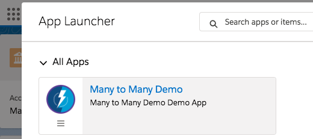

# Overview

Please see the [Installation](#install) section below for more on how to install on your Sandbox / Demo org.

**Please note: sample code (metadata api and dx formats) are is also available in the [mdapi](./mdapi) and [dx](./dx) folders above**

---

A Many-to-Many relationship is a relationship between two things where the relationship isn't exclusive.

In Salesforce terms for example, an Opportunity (representing a possible sale) can involve multiple types of products.

Yet that same type of product may be sold on other Opportunities.

The goal of this demo is to make it simple to navigate (or even to see and edit the data) quickly and easily in desktop and mobile.

----

NOTE: This project is for demonstration purposes.
For more information, please see the [Licensing](#licensing) section below

# Demo

A Many-to-Many relationship is a relationship between two things where the relationship isn't exclusive.

In Salesforce terms for example, an Opportunity (representing a possible sale) can involve multiple types of products.

Yet that same type of product may be sold on other Opportunities.

This can be quite difficult to do from Mobile.

## Is there a way we can get there faster?

## From 5 clicks to near instant..

(1 click to get to the compact layout, 2 to get to the full layout)

.

All in a way that is configurable  
and can be exposed in Quick Actions or App Builder pages

and works in both Desktop and Mobile
(through Quick Actions, App Builder pages, and so on...)

# How to run the demo

**1. Find the Many to Many Demo app in the App Launcher**

**2. Run the `Setup` button on the `Many to Many Demo Setup` tab**

**3. See the Far Children under any of the provided M2M Accounts or Contacts**

Contact

Account

# \#TLDR - How to extend the demo

(Gimme the short version)

**1. [Installation](#install) the app**

**2. [Setup a M2M Relationship record](#define-the-relationship-to-show)**

This doesn't create the relationship, but defines which ones we want to show - and how we want to show it (like defining which fields)

For example: [Account](https://developer.salesforce.com/docs/atlas.en-us.object_reference.meta/object_reference/sforce_api_objects_account.htm) and [Contact](https://developer.salesforce.com/docs/atlas.en-us.object_reference.meta/object_reference/sforce_api_objects_contact.htm) (with [Account Contact Relation](https://developer.salesforce.com/docs/atlas.en-us.object_reference.meta/object_reference/sforce_api_objects_accountcontactrelation.htm))

**3. Reference it [on a Lightning App Builder Page](#add-the-component-to-any-app-builder-page) or [through a QuickAction](#or-create-a-quick-action)**

**4. [See it in action](#see-it-in-action)**

(Continuing the example above, by exposing out the component on the Contact page layouts / app builder page, the component knows which Relation to use and orients it to show the Accounts and Account Contact Relations)

# Show me how to Make It My Own

A **One-to-Many relationship** is when one type record can relate to multiples of another type of record.

For example: a Book can have many Pages.

In this case, a single Page can't belong to more than one Book, otherwise it would be hard to read.

A **Many-to-Many relationship** is when the relationship isn't exclusive.

For example a Book can have many Authors, but an Author may also have written many Books.

A **CRM example of a Many-to-Many Relationship** would be:  
you can have Opportunities with more than one Product, but that same Product can be used in other Opportunities.

In this case, we use a **Junction Object** to link them: an OpportunityProduct - aka. OpportunityLineItem.

This special object references both the Opportunity along with the Product, and contains information that would apply only for this instance of a Product on this Opportunity. Such as the Number of Products to be ordered.

## Define the Relationship to Show

**1. Create a new `M2M Relationships` record, under the `Many to Many Demo` app.**

**2. Define the Relationship Alias**

This will be shown to the user if there are multiple relationships for an object.

**3. Define the Relationship Objects**

Here we define two objects that are related using a `Junction Object` (that relates to both of the other objects.

(Like `Opportunity Product` - relating Opportunity and Product, or `Account Contact Role` - relating Account and Contact)

Simply selecting either of the two objects (i.e. Account or Contact), will automatically show the `Junction Objects` known to the system.

It does not matter whether Account or Contact is first, as the same relationship can be used for both (it flips the relationship automatically).

**4. Define the fields to show for the relationship**

You can either use:

* the Compact Layout - the one assigned for that Object
* Or specify the fields to show and the order

	(Note: if the `Use Compact Layout?` is not checked and no fields are selected, then that object won't be shown.
	This can be helpful for special occasions, like hiding Product for Opportunity Products on Mobile)

## Add the component to any App Builder Page

We can see the component either through an App Builder Page, or Quick Action
on either / both of the objects defined in the relationship.

For example, if we made a relationship for Account and Contact, we can expose the same definition on both the Account and Contact record detail pages.

(It is perfectly fine to only show the relationship on one side, such as Opportunity for an Opportunity Product relationship)

## Or Create a Quick Action

Alternatively, we can create a QuickAction instead of a new App Builder page - for either / both of the objects.

(This will work on both Desktop and Mobile)

**1. Create a new Action**

Under the `Object Manager` find one of the Children to expose the 'Far Child' component.  Then click `New Action` under the `Button, Links, and Actions`.

**2. Define the QuickAction**

When defining the `Lightning Component` QuickAction, be sure to use the `ltng_AdvManyToManyList` component.

<table>
	<tr>
		<th>What to Set</th>
		<th>What does it mean?</th>
		<th>Example</th>
	</tr>
	<tr>
		<td>Action Type</td>
		<td>The type of Quick Action</td>
		<td>Lightning Component</td>
	</tr>
	<tr>
		<td>Lightning Component</td>
		<td>Which Lightning Component to show</td>
		<td>ltng_AdvManyToManyList</td>
	</tr>
	<tr>
		<td>Height</td>
		<td>The Height of the QuickAction Modal</td>
		<td>500px or so</td>
	</tr>
	<tr>
		<td>Standard Label Type</td>
		<td>Whether to use a standard label - or a custom label (none)</td>
		<td>Recommend: --None--</td>
	</tr>
	<tr>
		<td>Label</td>
		<td>The name of the QuickAction the user will see</td>
		<td>ex: 'Far Children', but can also be 'Contacts' or 'Accounts'</td>
	</tr>
	<tr>
		<td>Name</td>
		<td>The API Name of the QuickAction - used for maintenance</td>
		<td>MyFarChildQuickAction</td>
	</tr>
	<tr>
		<td>Description</td>
		<td>Admin visible description for why we have the Quick Action</td>
		<td>List of Contacts from this Account</td>
	</tr>
</table>

**3. Add Quick Action to Page Layout**

Remember to add the Quick Action to the Object's `Page Layout`

## See it in Action

Now, when you visit the page that shows the QuickAction / Lightning App Builder Page for any of those records.

For example: if we make a relationship for Account and Contact, made an App Builder page for Account Records, and a QuickAction for Contact records - then those Pages / Quick Actions can then show the component.

Contact

Account

---

# Install

There are three methods available for you to install this demo, so you can play around with it:

(Please note, all are intended as demonstrations and are not intended for deployment to Production as is)

* [Install via URL](#install-via-url)
* [Install Demo via Salesforce CLI](#install-via-salesforce-cli)
* [Install Demo via Ant/Metadata API](#install-via-metadata-api)

## Install via URL

This works very similar to an App Exchange install.

Please login to an available sandbox and click the link below.

[https://test.salesforce.com/packaging/installPackage.apexp?p0=04t6A0000038Gs2QAE](https://test.salesforce.com/packaging/installPackage.apexp?p0=04t6A0000038Gs2QAE)

(or simply navigate to `https://YOUR_SALESFORCE_INSTANCE/packaging/installPackage.apexp?p0=04t6A0000038Gs2QAE`  
if you are already logged in)

It is recommended to install for Admins Only (but all options will work)

##### Run Demo Setup

Next, click on the 'dice' and open the 'URL Hack Demo' app.

and run `Setup` from the `Demo Setup` tab.

This will then perform any additional setup (such as creating records, etc).

##### Run the Demos

Thats it. See the [How to Use](#how-to-use) section for how to use the app.

## Installing via the Salesforce CLI

This assumes you have already installed the [Salesforce CLI]() and [Connected the Salesforce CLI to your org](https://developer.salesforce.com/docs/atlas.en-us.sfdx_dev.meta/sfdx_dev/sfdx_dev_auth_web_flow.htm).

However, the Salesforce CLI can be used with any org and does not require Salesforce DX to be enabled. (Although enabling the DX / Dev Hub would give some great benefits, and would only require care of [certain object permissions: Scratch Org Info, ActiveScratchOrg, NamespaceRegistry](https://developer.salesforce.com/docs/atlas.en-us.sfdx_setup.meta/sfdx_setup/sfdx_setup_add_users.htm) - as they are not available in all orgs)

**1.** Run the following command:

	sfdx force:mdapi:deploy -d mdapi -u [[orgAlias]] -w

**2.** Add the permission set to your user

	sfdx force:user:permset:assign -n ManyToManyDemoAdmin -u [[orgAlias]]

##### Run the Demos

Thats it. See the [How to Use](#how-to-use) section for how to use the app.

	sfdx force:org:open -u [[orgAlias]]
